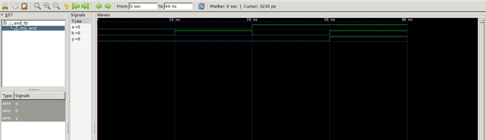

# AND Gate Implementation in Verilog

This repository contains a simple implementation of a 2-input AND gate in Verilog, along with a testbench to simulate its behavior.

## Definition

An **AND gate** is a fundamental digital logic gate that performs a logical conjunction on two or more binary inputs. It outputs true (1) only when all its inputs are true (1). The logical operation can be expressed as:

- **Expression**: \( Y = A \land B \)
- **Truth Table**:

| A | B | Y (A AND B) |
|---|---|-------------|
| 0 | 0 | 0           |
| 0 | 1 | 0           |
| 1 | 0 | 0           |
| 1 | 1 | 1           |



## Code Structure

```
.
├── and_gate.v     # Verilog implementation of the AND gate
└── and_tb.v       # Testbench for the AND gate
```

### `and_gate.v`

This file contains the Verilog code for the AND gate:

```verilog
module and_gate (
    input wire a,    // First input
    input wire b,    // Second input
    output wire y    // Output
);

    assign y = a & b; // AND operation

endmodule
```

### `and_tb.v`

This file contains the testbench for simulating the AND gate:

```verilog
`timescale 1ns/1ps // Specify the time scale

module and_tb;
    reg a, b;        // Declare inputs as registers
    wire y;         // Declare output as wire

    // Instantiate the AND gate
    and_gate my_and (
        .a(a),
        .b(b),
        .y(y)
    );

    initial begin
        // Dump VCD file
        $dumpfile("and_gate.vcd"); // Specify the name of the VCD file
        $dumpvars(0, and_tb);       // Dump all variables in the and_tb module

        // Test cases
        $monitor("At time %t: a = %b, b = %b, y = %b", $time, a, b, y);

        a = 0; b = 0; #10;
        a = 0; b = 1; #10;
        a = 1; b = 0; #10;
        a = 1; b = 1; #10;
        $finish; // End the simulation
    end
endmodule
```

## How to Simulate

1. Clone the repository:

   ```bash
   git clone <repository-url>
   cd and-gate
   ```

2. Open the Verilog files in your preferred simulator.

3. Compile and run the testbench to observe the behavior of the AND gate.

For example, using Icarus Verilog:

```bash
iverilog -o and_tb.vvp and_gate.v and_tb.v
vvp and_tb.vvp
```

## Expected Output

When you run the testbench, you should see output indicating the values of `a`, `b`, and `y` at each time step, similar to:

```
At time 0: a = 0, b = 0, y = 0
At time 10: a = 0, b = 1, y = 0
At time 20: a = 1, b = 0, y = 0
At time 30: a = 1, b = 1, y = 1
```
